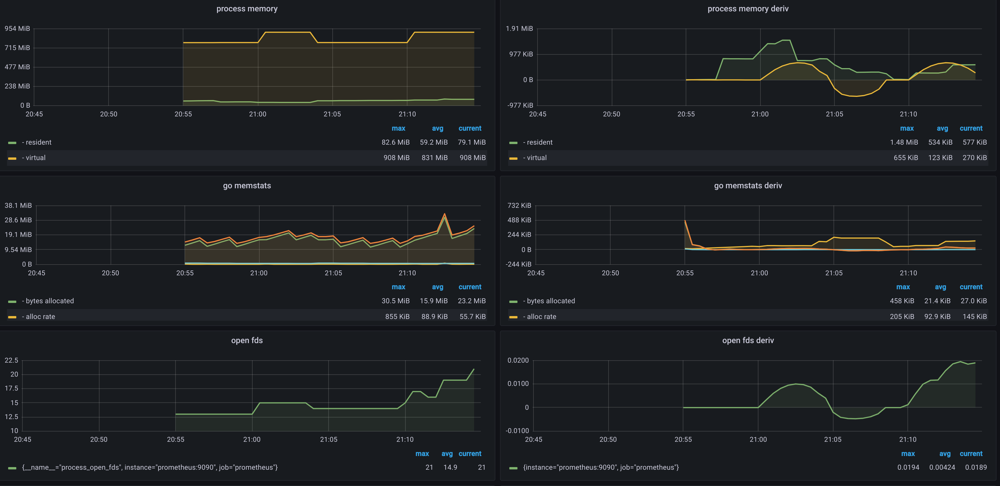
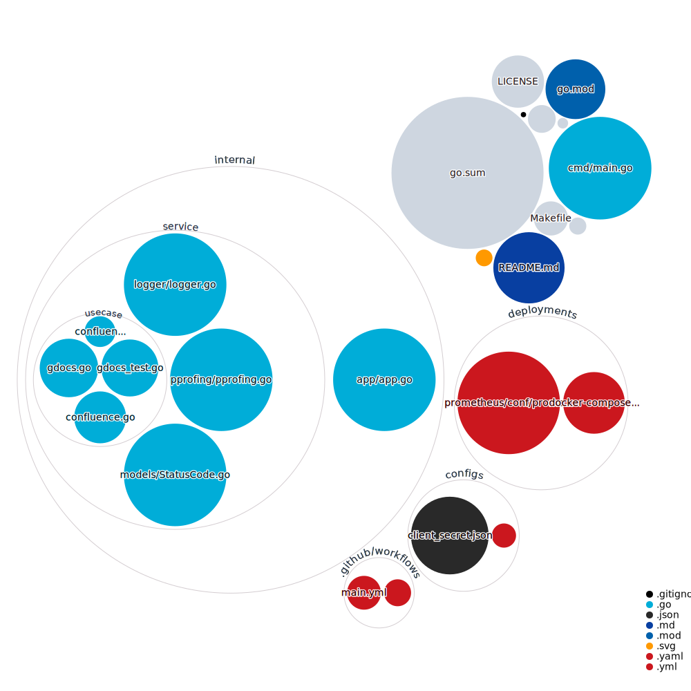

# Тестовое задание для HFLabs

В базе знаний есть информация о кодах ответа нашего API.
Необходимо написать скрипт, который парсит эту табличку и переносит ее в гуглодоку. Предусмотреть, что в будущем необходимо будет синхронизировать данные в гуглодоке, если что-то изменится в базе знаний.
В результате нужно прислать:
ссылку на код на гитхабе;
ссылку на гуглодоку с перенесенной табличкой;
информацию, сколько времени заняло выполнение задания.
Предпочтительный язык для выполнения задания — go. Допустимые языки — python, ruby.

# Результат

https://docs.google.com/spreadsheets/d/1x6OwkOgIpkWUiUrdLXQSYfBDUg2nYAGotaWx24z2fB8/edit#gid=0

# Реализация

На удаленной машине запущен сервис, каждые 12 часов обновляющий гугл таблицу. К приложению подключен сбор метрик с помощью Prometheus и их визуализация c Grafana.

<a></img></a>

# Команды

Запуск

```bash
make run
```

Тестирование
```bash
make test
```

Тестовое покрытие
```bash
make cover
```

Профилирование
```bash
make pprof
```

Остановка
```bash
make down
```

# Структура проекта

<a><a>
